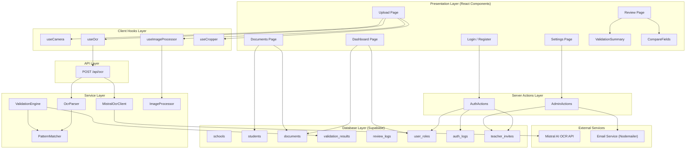
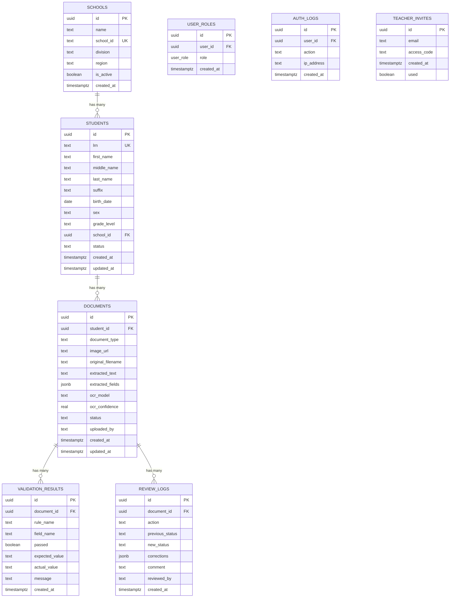

# DocuValidate System — Class Diagram

## Full System Class Diagram

```mermaid
classDiagram
    direction TB

    %% ═══════════════════════════════════════════════
    %% DATABASE ENTITIES (Supabase / PostgreSQL)
    %% ═══════════════════════════════════════════════

    class School {
        +uuid id
        +string name
        +string school_id
        +string division
        +string region
        +boolean is_active
        +timestamptz created_at
    }

    class Student {
        +uuid id
        +string lrn
        +string first_name
        +string middle_name
        +string last_name
        +string suffix
        +date birth_date
        +string sex
        +string grade_level
        +uuid school_id
        +StudentStatus status
        +timestamptz created_at
        +timestamptz updated_at
    }

    class Document {
        +uuid id
        +uuid student_id
        +DocumentType document_type
        +string image_url
        +string original_filename
        +string extracted_text
        +jsonb extracted_fields
        +string ocr_model
        +real ocr_confidence
        +DocumentStatus status
        +string uploaded_by
        +timestamptz created_at
        +timestamptz updated_at
    }

    class ValidationResult {
        +uuid id
        +uuid document_id
        +string rule_name
        +string field_name
        +boolean passed
        +string expected_value
        +string actual_value
        +string message
        +timestamptz created_at
    }

    class ReviewLog {
        +uuid id
        +uuid document_id
        +ReviewAction action
        +string previous_status
        +string new_status
        +jsonb corrections
        +string comment
        +string reviewed_by
        +timestamptz created_at
    }

    class UserRole {
        +uuid id
        +uuid user_id
        +user_role role
        +timestamptz created_at
    }

    class AuthLog {
        +uuid id
        +uuid user_id
        +string action
        +string ip_address
        +timestamptz created_at
    }

    class TeacherInvite {
        +uuid id
        +string email
        +string access_code
        +timestamptz created_at
        +boolean used
    }

    %% ═══════════════════════════════════════════════
    %% ENUMS
    %% ═══════════════════════════════════════════════

    class DocumentStatus {
        <<enumeration>>
        submitted
        extracted
        validated
        needs_review
        corrected
        approved
        rejected
    }

    class DocumentType {
        <<enumeration>>
        sf9
        sf10
        school_id
        birth_cert
        other
    }

    class StudentStatus {
        <<enumeration>>
        active
        inactive
        transferred
    }

    class ReviewAction {
        <<enumeration>>
        approve
        reject
        correct
        flag
        resubmit
    }

    class UserRoleEnum {
        <<enumeration>>
        admin
        teacher
    }

    %% ═══════════════════════════════════════════════
    %% OCR & DATA EXTRACTION LAYER
    %% ═══════════════════════════════════════════════

    class MistralOcrClient {
        <<service>>
        +callMistralOcr(imageDataUrl: string, apiKey: string) MistralOcrResult
    }

    class MistralOcrResult {
        +string text
        +number pageCount
    }

    class OcrResponse {
        +string text
        +ExtractedFields fields
        +number confidence
        +string model
        +string error
    }

    class OcrApiRoute {
        <<API Route>>
        +POST(request: Request) OcrResponse
    }

    class OcrParser {
        <<service>>
        +parseOcrText(text: string) ExtractedFields
        +extractNameAndLrn(text: string) string
        -extractField(text, label, followingLabels) string
        -splitName(fullName) NameParts
    }

    class ExtractedFields {
        +string name
        +string first_name
        +string middle_name
        +string last_name
        +string lrn
        +string grade_level
        +string school_name
        +string birth_date
        +string sex
    }

    class OcrResult {
        +string text
        +ExtractedFields fields
        +number confidence
        +string model
    }

    %% ═══════════════════════════════════════════════
    %% IMAGE PROCESSING LAYER
    %% ═══════════════════════════════════════════════

    class ImageProcessor {
        <<service>>
        +processImage(source: HTMLImageElement, adjustments: ImageAdjustments) string
        +computeStdDev(imageData: ImageData) number
        +sharpenImageData(imageData: ImageData, amount: number) ImageData
        +getContainedImageRect(container, img) Rect
        +readFileAsDataUrl(file: File) string
    }

    class ImageAdjustments {
        +number brightness
        +number contrast
        +number sharpness
    }

    %% ═══════════════════════════════════════════════
    %% VALIDATION ENGINE
    %% ═══════════════════════════════════════════════

    class ValidationEngine {
        <<service>>
        +validateFields(fields, context, rules) ValidationReport
        +getValidationStatus(fields, context) string
    }

    class ValidationReport {
        +string status
        +ValidationRuleResult[] results
        +number passCount
        +number failCount
        +number totalRules
    }

    class ValidationRuleResult {
        +string ruleName
        +string fieldName
        +boolean passed
        +string expectedValue
        +string actualValue
        +string message
        +string severity
    }

    class ValidationRule {
        +string name
        +string field
        +string message
        +string severity
        +check(value: string, context: ValidationContext) boolean
    }

    class ValidationContext {
        +string[] knownSchools
        +ExtractedFields allFields
        +number ocrConfidence
    }

    class PatternMatcher {
        <<utility>>
        +RegExp LRN_PATTERN
        +RegExp NAME_PATTERN
        +RegExp GRADE_PATTERN
        +RegExp[] DATE_PATTERNS
        +RegExp SEX_PATTERN
        +RegExp SCHOOL_ID_PATTERN
        +normalizeLrn(raw: string) string
        +isValidLrn(raw: string) boolean
        +looksLikeDate(value: string) boolean
        +normalizeSex(raw: string) string
    }

    %% ═══════════════════════════════════════════════
    %% CLIENT-SIDE HOOKS (Controllers)
    %% ═══════════════════════════════════════════════

    class UseCamera {
        <<hook>>
        +RefObject videoRef
        +MediaDeviceInfo[] devices
        +string selectedDeviceId
        +number cameraZoom
        +boolean hasHardwareZoom
        +string cameraError
        +setSelectedDeviceId(id) void
        +setCameraZoom(zoom) void
        +captureFrame() string
    }

    class UseImageProcessor {
        <<hook>>
        +string rawImage
        +string processedImage
        +ImageAdjustments adjustments
        +boolean isProcessing
        +setRawImage(img) void
        +setAdjustments(adj) void
        +resetAdjustments() void
    }

    class UseOcr {
        <<hook>>
        +boolean isExtracting
        +string error
        +extract(image, extractFields) OcrResponse
        +setError(err) void
    }

    class UseCropper {
        <<hook>>
        +RefObject containerRef
        +RefObject imageRef
        +boolean isCropping
        +CropItem[] crops
        +Rect dragRect
        +setIsCropping(v) void
        +setCrops(crops) void
        +onPointerDown(e) void
        +onPointerMove(e) void
        +onPointerUp() void
        +clearCrops() void
    }

    class CropItem {
        +string id
        +string image
        +boolean hasContent
    }

    %% ═══════════════════════════════════════════════
    %% UI COMPONENTS (Views)
    %% ═══════════════════════════════════════════════

    class CompareFields {
        <<component>>
        +ExtractedFields extractedFields
        +Student officialRecord
        +render() JSX
    }

    class ValidationSummary {
        <<component>>
        +ValidationReport report
        +render() JSX
    }

    class StatsGrid {
        <<component>>
        +StatItem[] stats
        +render() JSX
    }

    class ProcessingChart {
        <<component>>
        +ChartData[] data
        +string title
        +render() JSX
    }

    %% ═══════════════════════════════════════════════
    %% SERVER ACTIONS (Controllers)
    %% ═══════════════════════════════════════════════

    class AuthActions {
        <<server action>>
        +login(formData: FormData) Result
        +register(formData: FormData) Result
        +logout() void
    }

    class AdminActions {
        <<server action>>
        +generateTeacherCode(formData: FormData) Result
    }

    %% ═══════════════════════════════════════════════
    %% RELATIONSHIPS — Database
    %% ═══════════════════════════════════════════════

    Student "many" --> "1" School : belongs to
    Document "many" --> "1" Student : belongs to
    ValidationResult "many" --> "1" Document : validates
    ReviewLog "many" --> "1" Document : reviews
    Document --> DocumentStatus : has status
    Document --> DocumentType : has type
    Student --> StudentStatus : has status
    ReviewLog --> ReviewAction : has action
    UserRole --> UserRoleEnum : has role

    %% ═══════════════════════════════════════════════
    %% RELATIONSHIPS — OCR Pipeline
    %% ═══════════════════════════════════════════════

    OcrApiRoute --> MistralOcrClient : calls
    MistralOcrClient --> MistralOcrResult : returns
    OcrApiRoute --> OcrParser : parses text with
    OcrParser --> ExtractedFields : produces
    OcrApiRoute --> OcrResponse : returns
    OcrResponse --> ExtractedFields : contains

    %% ═══════════════════════════════════════════════
    %% RELATIONSHIPS — Validation Pipeline
    %% ═══════════════════════════════════════════════

    ValidationEngine --> ValidationRule : executes
    ValidationEngine --> ValidationReport : produces
    ValidationReport --> ValidationRuleResult : contains
    ValidationRule --> ValidationContext : uses context
    ValidationRule --> PatternMatcher : uses patterns
    ValidationContext --> ExtractedFields : references
    ValidationEngine --> ExtractedFields : validates

    %% ═══════════════════════════════════════════════
    %% RELATIONSHIPS — Image Processing
    %% ═══════════════════════════════════════════════

    UseImageProcessor --> ImageProcessor : delegates to
    UseImageProcessor --> ImageAdjustments : configures
    ImageProcessor --> ImageAdjustments : applies

    %% ═══════════════════════════════════════════════
    %% RELATIONSHIPS — Hooks to Services
    %% ═══════════════════════════════════════════════

    UseOcr --> OcrApiRoute : calls API
    UseOcr --> OcrResponse : receives
    UseCamera --> UseImageProcessor : feeds frames to
    UseCropper --> ImageProcessor : uses computeStdDev
    UseCropper --> CropItem : produces

    %% ═══════════════════════════════════════════════
    %% RELATIONSHIPS — UI to Data
    %% ═══════════════════════════════════════════════

    CompareFields --> ExtractedFields : displays
    CompareFields --> Student : compares against
    ValidationSummary --> ValidationReport : displays

    %% ═══════════════════════════════════════════════
    %% RELATIONSHIPS — Auth & Admin
    %% ═══════════════════════════════════════════════

    AuthActions --> UserRole : checks role
    AuthActions --> AuthLog : logs events
    AuthActions --> TeacherInvite : validates code
    AdminActions --> TeacherInvite : generates invite
    AdminActions --> UserRole : checks admin
```

---

## Simplified Layer Architecture

```mermaid
graph TB
    subgraph Presentation ["Presentation Layer (React Components)"]
        Dashboard["Dashboard Page"]
        Upload["Upload Page"]
        Documents["Documents Page"]
        Review["Review Page"]
        Settings["Settings Page"]
        Login["Login / Register"]
        VS["ValidationSummary"]
        CF["CompareFields"]
    end

    subgraph Hooks ["Client Hooks Layer"]
        UC["useCamera"]
        UIP["useImageProcessor"]
        UO["useOcr"]
        UCR["useCropper"]
    end

    subgraph Actions ["Server Actions Layer"]
        AA["AuthActions"]
        ADA["AdminActions"]
    end

    subgraph API ["API Layer"]
        OCR_API["POST /api/ocr"]
    end

    subgraph Services ["Service Layer"]
        MC["MistralOcrClient"]
        OP["OcrParser"]
        VE["ValidationEngine"]
        PM["PatternMatcher"]
        IP["ImageProcessor"]
    end

    subgraph Database ["Database Layer (Supabase)"]
        TB_S["schools"]
        TB_ST["students"]
        TB_D["documents"]
        TB_VR["validation_results"]
        TB_RL["review_logs"]
        TB_UR["user_roles"]
        TB_AL["auth_logs"]
        TB_TI["teacher_invites"]
    end

    subgraph External ["External Services"]
        MISTRAL["Mistral AI OCR API"]
        EMAIL["Email Service (Nodemailer)"]
    end

    %% Presentation → Hooks
    Upload --> UC
    Upload --> UIP
    Upload --> UO
    Upload --> UCR
    Review --> VS
    Review --> CF

    %% Hooks → API
    UO --> OCR_API
    UIP --> IP

    %% API → Services
    OCR_API --> MC
    OCR_API --> OP

    %% Services → Services
    OP --> PM
    VE --> PM

    %% Services → External
    MC --> MISTRAL

    %% Actions → Database
    AA --> TB_UR
    AA --> TB_AL
    AA --> TB_TI
    ADA --> TB_TI
    ADA --> EMAIL

    %% Presentation → Actions
    Login --> AA
    Settings --> ADA

    %% Services → Database
    VE --> TB_VR
    Dashboard --> TB_D
    Dashboard --> TB_UR
    Documents --> TB_D
    Documents --> TB_ST
```

---

## Entity Relationship Diagram (Database)

```mermaid
erDiagram
    SCHOOLS {
        uuid id PK
        text name
        text school_id UK
        text division
        text region
        boolean is_active
        timestamptz created_at
    }

    STUDENTS {
        uuid id PK
        text lrn UK
        text first_name
        text middle_name
        text last_name
        text suffix
        date birth_date
        text sex
        text grade_level
        uuid school_id FK
        text status
        timestamptz created_at
        timestamptz updated_at
    }

    DOCUMENTS {
        uuid id PK
        uuid student_id FK
        text document_type
        text image_url
        text original_filename
        text extracted_text
        jsonb extracted_fields
        text ocr_model
        real ocr_confidence
        text status
        text uploaded_by
        timestamptz created_at
        timestamptz updated_at
    }

    VALIDATION_RESULTS {
        uuid id PK
        uuid document_id FK
        text rule_name
        text field_name
        boolean passed
        text expected_value
        text actual_value
        text message
        timestamptz created_at
    }

    REVIEW_LOGS {
        uuid id PK
        uuid document_id FK
        text action
        text previous_status
        text new_status
        jsonb corrections
        text comment
        text reviewed_by
        timestamptz created_at
    }

    USER_ROLES {
        uuid id PK
        uuid user_id FK
        user_role role
        timestamptz created_at
    }

    AUTH_LOGS {
        uuid id PK
        uuid user_id FK
        text action
        text ip_address
        timestamptz created_at
    }

    TEACHER_INVITES {
        uuid id PK
        text email
        text access_code
        timestamptz created_at
        boolean used
    }

    SCHOOLS ||--o{ STUDENTS : "has many"
    STUDENTS ||--o{ DOCUMENTS : "has many"
    DOCUMENTS ||--o{ VALIDATION_RESULTS : "has many"
    DOCUMENTS ||--o{ REVIEW_LOGS : "has many"
```
