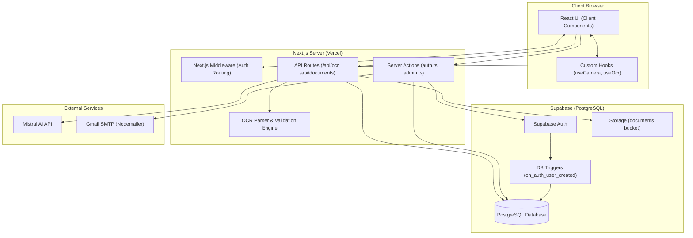
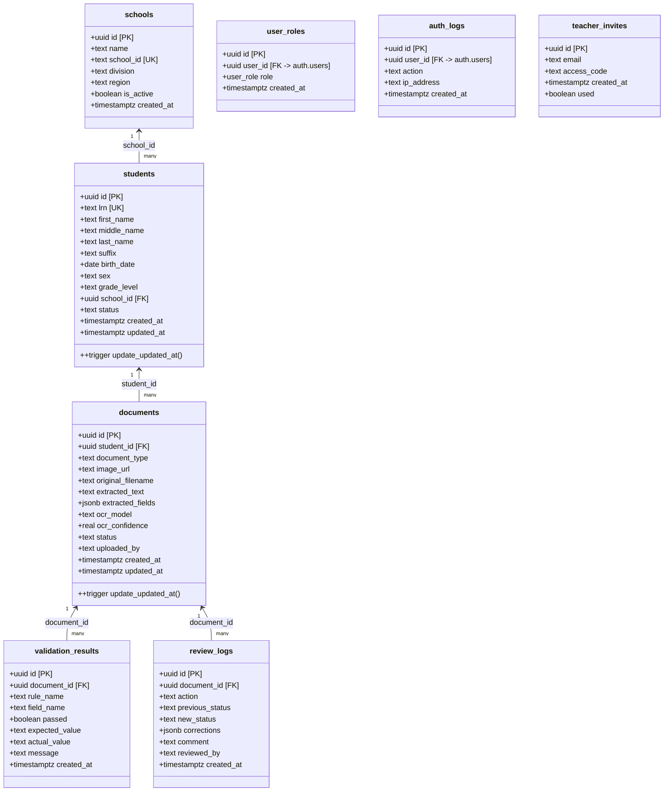
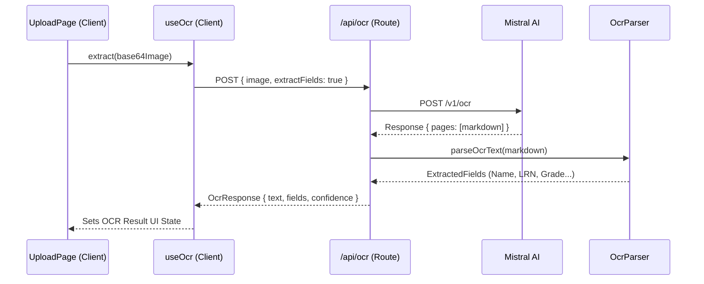
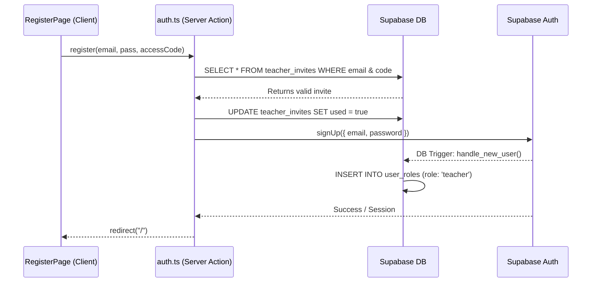
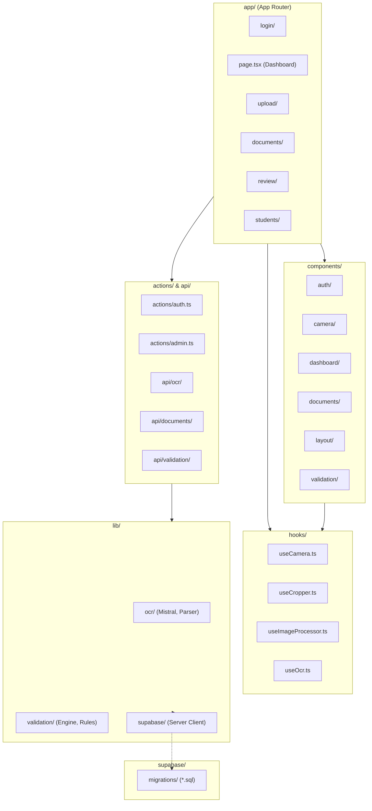
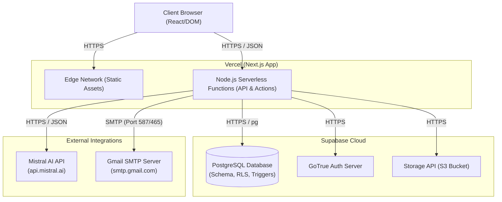

# DocuValidate — System Design & UML Documentation

This document describes the actual architecture, data models, and request flows of the DocuValidate (TrOCR) web application, based on a direct inspection of the codebase and connected Supabase schema.

---

## 1. System Architecture Diagram

The application uses a modern hybrid rendering architecture (Next.js App Router) with a distinct separation between presentation, server-side logic, and a fully managed backend as a service (Supabase).



**Interpretation:**
The system architecture follows a standard Next.js App Router pattern. Incoming requests first hit the Next.js `middleware.ts`, which validates session cookies via Supabase Auth and redirects unauthenticated users to `/login`. The Client Browser runs React Client Components (e.g., `useCamera`, `useCropper`) to handle device hardware and image processing. When a user acts, the UI communicates with the Next.js Server either via Server Actions (for auth and admin tasks) or API Routes (for OCR and data fetching). The server executes business logic (like the `ValidationEngine` and `MistralOcrClient`) and connects securely to Supabase for database operations, storage, and authentication. Supabase handles database-level logic, such as triggers that automatically assign roles to new users.

**Step-by-Step Request Flow (Admin Invites Teacher):**
1. The Admin fills out the "Teacher Email" form in the Settings UI and clicks "Send Access Code".
2. The form triggers the `generateTeacherCode` Server Action.
3. The Action queries the `user_roles` table in Supabase to verify the requesting user has the `'admin'` role.
4. The Action generates a random 6-character access code and inserts it into the `teacher_invites` Supabase table.
5. The Action uses `nodemailer` to connect to the external Gmail SMTP server and sends the access code to the provided email.
6. The Action revalidates the UI path and returns a success message to the Client.

---

## 2. Use Case Diagram

There are exactly two distinct user roles implemented in the database and RLS policies: **Admin** and **Teacher**. 

```mermaid
usecaseDiagram
    actor Admin
    actor Teacher

    package "DocuValidate Navigation" {
        usecase "UC1: View Dashboard Stats" as UC1
        usecase "UC1a: View Auth Logs" as UC1a
        usecase "UC2: Upload & Extract Document" as UC2
        usecase "UC3: Browse Documents" as UC3
        usecase "UC4: Process Review Queue" as UC4
        usecase "UC5: View Student Directory" as UC5
        usecase "UC6: View Reports" as UC6
        usecase "UC7: View Settings" as UC7
        usecase "UC7a: Generate Teacher Invites" as UC7a
    }

    Teacher --> UC1
    Teacher --> UC2
    Teacher --> UC3
    Teacher --> UC4
    Teacher --> UC5
    Teacher --> UC6
    Teacher --> UC7

    Admin --> UC1
    Admin --> UC1a
    Admin --> UC2
    Admin --> UC3
    Admin --> UC4
    Admin --> UC5
    Admin --> UC6
    Admin --> UC7
    Admin --> UC7a
```

**Interpretation:**
The navigation sidebar renders the exact same primary links for both roles, in this order: Dashboard, Upload Document, Documents, Review Queue, Students, Reports, and Settings. However, the capabilities within those views differ by role. Admins have extended permissions: they can view User Activity (Auth Logs) on the Dashboard (`UC1a`), and they have the ability to generate and email Teacher Access Codes in the Settings view (`UC7a`). Teachers can access the Settings page but are met with an "Admin Privileges Required" block.

---

## 3. Class / Data Model Diagram

This diagram maps 1:1 to the actual Supabase database schema and migrations (`001_initial_schema.sql`, `002_auth_rbac.sql`, `combined_setup.sql`).



**Interpretation:**
The database design centers around `documents` and `students`. When a document is processed, it is linked to a student (if successfully identified) via `student_id`. The automated `ValidationEngine` writes its findings to `validation_results`, which are uniquely tied to a specific document. Any manual teacher interventions are audited in `review_logs`. Security and RBAC (Role-Based Access Control) are managed by linking `user_roles` and `auth_logs` directly to Supabase's internal `auth.users` table.

---

## 4. Sequence Diagrams

### 4.1 Document Upload & OCR Extraction
Maps the flow from the `/upload` page UI through the Mistral API and Validation Engine.



**Interpretation:**
This sequence highlights the application's reliance on client-side hooks to communicate with the Next.js API. The `/api/ocr` route acts as a secure proxy, holding the `MISTRAL_API_KEY` so it is never exposed to the client. After Mistral returns raw markdown, the backend runs the `OcrParser` (using RegEx pattern matching) to convert the unstructured text into a structured JSON `ExtractedFields` object before returning it to the browser.

### 4.2 Teacher Registration (Access Code Validation)
Maps the secure registration flow using Server Actions.



**Interpretation:**
This sequence demonstrates the secure sign-up process. The Next.js Server Action (`auth.ts`) handles the registration request directly. It queries the `teacher_invites` table to validate the access code. If valid, the invite is burned (marked as used), and the user is created in Supabase Auth. A Postgres trigger (`on_auth_user_created`) automatically intercepts the creation event and assigns the new user a default `'teacher'` role in the `user_roles` table.

---

## 5. Package / Module Diagram



**Interpretation:**
The folder structure maps cleanly to architectural layers. `app/` handles routing and page layouts. `components/` and `hooks/` encapsulate the complex client-side view logic (like hardware camera access and image cropping). The `actions/` and `api/` directories form the controller layer, mediating between the client and the core business logic found in `lib/`. The database schema and security rules are version-controlled in `supabase/migrations/`.

---

## 6. Deployment Diagram



**Interpretation:**
The application is deployed across managed cloud providers. Vercel hosts the Next.js application, serving static files via its Edge network and executing Server Actions and API routes in serverless Node.js functions. Supabase acts as the persistence and authentication layer, providing a managed PostgreSQL database, GoTrue authentication, and file storage for uploaded document images. External calls are made securely from the Vercel serverless environment to Mistral AI via HTTPS API calls and to Gmail via SMTP for outgoing teacher invites. No database credentials or third-party API keys are exposed to the Client Browser.
